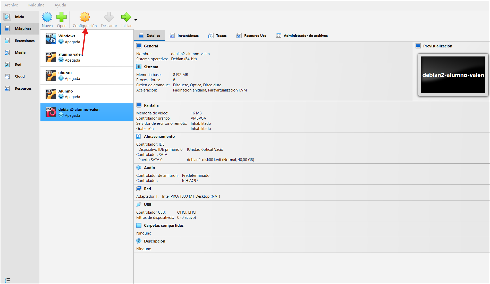
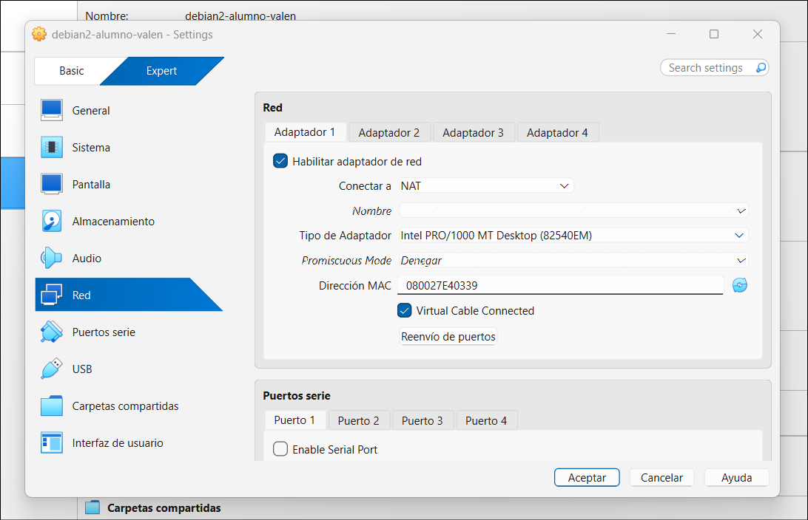
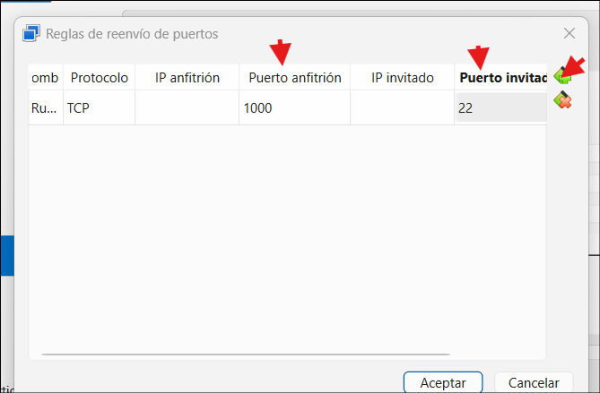

## Virtual box
1. Primero hacer clic sobre la VM, luego en el boton configuracion. 


2. Se deben dirigir al apartado de RED, dentro deberan tocar "reenvio de puertos"


3. Deben hacer clic en agregar y van a colocar la informacion que se adjunta en la imagen


4. Cuando terminen de hacer el reenvio de puerto prenden la VM, y deberan copiar los comandos que estan mas abajo, lo que va hacer es eliminar la interfaz grafica, reiniciar la VM, y ya no tendran un escritorio.

5. Se deberan conectar desde una terminal de su equipo colocando:
```ssh alumno@localhost -p 1000```

## Comandos a ejecutar en la consola de la VM

```bash
sudo systemctl set-default multi-user.target
sudo apt purge -y task-gnome-desktop task-spanish-desktop gnome-core gnome-shell gdm3
sudo apt autoremove --purge -y
sudo apt clean
sudo apt purge -y 'xserver-xorg*'
sudo apt autoremove --purge -y
sudo apt clean
sudo apt purge -y cups cups-browsed avahi-daemon modemmanager bluetooth bluez
sudo apt autoremove --purge -y
sudo apt clean
sudo journalctl --vacuum-time=7d
sudo reboot
```